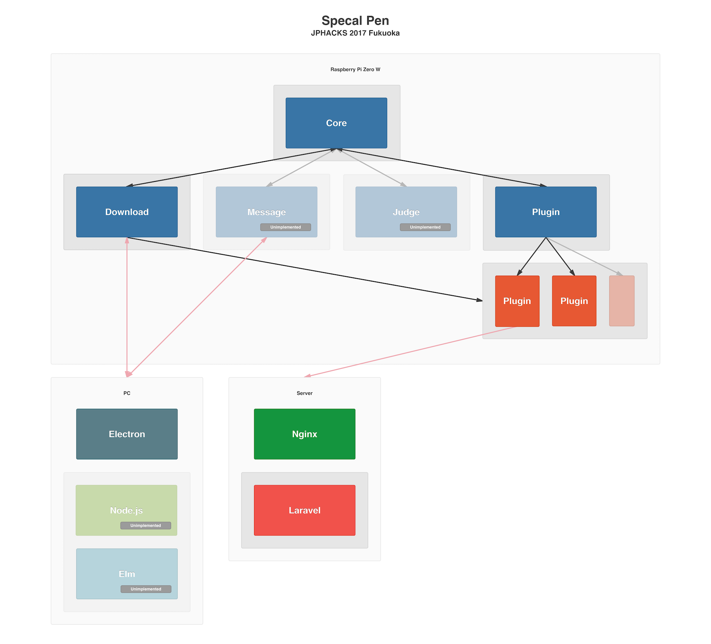

# すぺちゃるペン

## 製品概要
### X Tech（X → 教育）

### 背景（製品開発のきっかけ、課題等）
教育者，特に何かと時間と手間を必要とする初等教育現場で働く方の負担を軽減する方法はないかと考えた．

子供達のそれぞれにあった教育を時間をかけて行うとそれだけで膨大な時間を必要としてしまう．
その時間，負担を少しでも軽減するために，一つの解決策として試験などの記述をペンを使いデジタルデータ化し，採点を行うことができるようにすることで，採点などにかかる時間の削減を行うことができないかと考えた．

### 製品説明（具体的な製品の説明）
本製品は,ペン型の AD コンバーターである.
具体的には,本デバイスを装着したペンで文字を書くと, PC 上からその文字がフォントとして扱うことが可能となる.
また,デバイスと PC 間の通信の方法として Bluetooth と Wi-Fi を利用する.
動的にプラグインを追加するという形で機能を拡張することができる．

#### 使い方
- Bluetooth を介して PC と接続して， Raspberry Pi Zero W がインターネットに接続するために必要な情報を送信してペン単体でインターネットに接続できるようにする
- Wi-Fi と PC のクライアントを介して，ペンにプラグインを追加する
- Raspberry Pi Zero W と加速度センサを使用して加速度を取得し，入力された文字を判別する
- 追加されたプラグインの標準入力に判定された文字を送信する

#### 構成

### 特長

#### 1. センサーから取得した加速度を用いて文字を認識することができる
#### 2. キャップ型デバイスだからこそ得られる汎用性の高さ
#### 3. プラグインによる,機能面における豊かな拡張性

### 解決出来ること
初等教育現場における,宿題や提出物の採点にかかる教師の負担の軽減を行う.

### 今後の展望
デバイスの小型や文字認識の精度向上.
対応文字(ひらがな,カタカナ,漢字,外国語)の拡大.

## 開発内容・開発技術

### 活用した技術
機械学習
文字認識には加速度データを特徴量として学習したネットワークモデルを使用し，手法としてリカレントニューラルネットワークを使用した．

#### API・データ
特になし

#### フレームワーク・ライブラリ・モジュール
##### Raspberry Pi Zero W
[Pykka](https://www.pykka.org/en/latest/)  
[Keras](https://keras.io/)  
[TensorFlow](https://www.tensorflow.org/)  
[Requests](http://docs.python-requests.org/en/master/)  
[Numpy](http://www.numpy.org/)
##### Server
[Laravel](https://laravel.com/)
##### Client ([package.json](https://github.com/jphacks/FK_1704/blob/master/Client/package.json)/[elm-package.json](https://github.com/jphacks/FK_1704/blob/master/Client/elm-package.json))
[Express](http://expressjs.com/)  
[Socket.IO](https://socket.io/)  
[Electron](https://electron.atom.io/)  
[Elm](http://elm-lang.org/)  
[Babel](https://babeljs.io/)  
[Webpack](https://webpack.js.org/)  
[Bulma](https://bulma.io/)

#### デバイス
[Raspberry Pi Zero W](https://www.raspberrypi.org/products/raspberry-pi-zero-w/)  
MPU-9250 9軸センサモジュール

### 研究内容・事前開発プロダクト（任意）
2日間で全ての機能の開発を行いました

### 独自開発技術（Hack Dayで開発したもの）
0 から 9 までの数値を記述する際の加速度のデータセット  
加速度を取得するためのペンをイメージしたデバイス

#### 2日間に開発した独自の機能・技術
[0 から 9 までの数値を記述する際の加速度のデータセット](https://github.com/jphacks/FK_1704/tree/master/python/dataset100)
